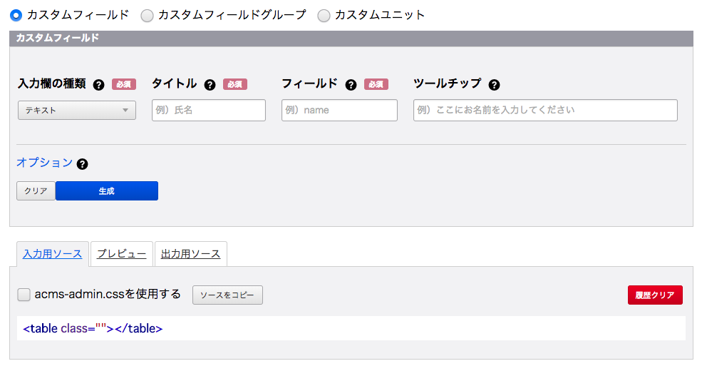

# カスタムフィールドメーカー

a-blog cms 用のカスタムフィールドメーカー

カスタムフィールドメーカーではカスタムフィールドを毎回どこからからコピペして書き換えたりしなくてもラベルや値、サイズなど入力していくだけカスタムフィールドのHTMLが作れてしまう便利な機能になります。

カスタムフィールドではテキストや画像などさまざまなカスタムフィールドを組み合わせることができます。

カスタムフィールドはお問い合わせフォームやエントリー作成画面、ブログ・カテゴリー・ユーザー・モジュールの管理画面で使います。
